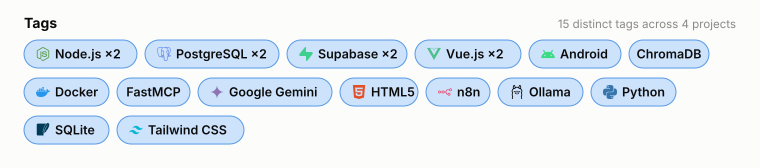
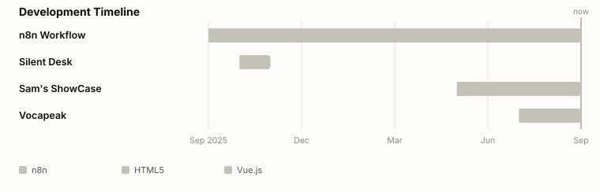
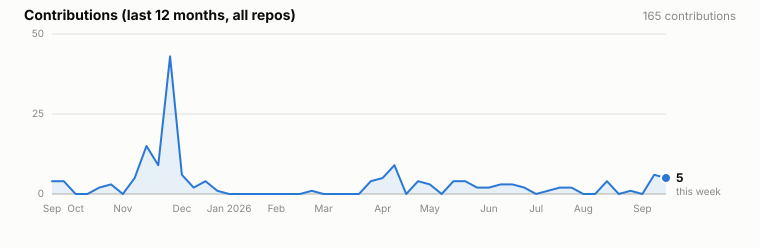

<h1 align="center">Sam Huang</h1>

Full-Stack Engineer · Carbon Accounting × AI Systems · .NET 8 / C# · Vue 3 · MSSQL

  <a href="README.zh-TW.md">繁體中文</a> ·
  <a href="https://www.linkedin.com/">LinkedIn</a> ·
  <a href="mailto:sam.huang.veda@gmail.com">Email</a> ·
  <!-- TODO: swap in your portfolio / Linktree link -->
  <a href="#">Portfolio</a>

Rather than lead with "which languages I know," I'd rather this page show **what kinds of projects I actually build, how long they take, and how big they get**. The tech stack is at the bottom, as an appendix, not the headline.

Currently a full-stack engineer, and part-time in the graduate program (CS) at National Chung Hsing University. My main line of work is an enterprise carbon-emissions management system; alongside that I maintain a few side projects.

---

### Tags

### Development Timeline

### Contributions

---

### Projects

#### [Vocapeak](https://github.com/https://github.com/samhuang95/Vocabulary_Trainer)
`Vue.js` `Android` `Supabase` `Node.js` `PostgreSQL` · 2026-07 – ongoing

Vocabulary practice app (web + Android): daily review cards, a review queue, and a Goals page — built to prepare for the TOEIC exam, web link: https://vocapeak.com
- Highlight: The Goals page auto-calculates daily practice load from a target scope and deadline
- Stack: Vue.js · Android · Supabase · Node.js · PostgreSQL

#### [Sam's ShowCase](https://github.com/https://github.com/samhuang95/MyShowCase)
`Vue.js` `Tailwind CSS` `Supabase` `Node.js` `PostgreSQL` · 2026-05 – ongoing

A personal portfolio website aggregating all my works, including projects, articles, resume, and contact information, web link: https://sam-showcase.com
- Highlight: A personal portfolio website aggregating all my works, including projects, articles, resume, and contact information
- Stack: Vue.js · Tailwind CSS · Supabase · Node.js · PostgreSQL

#### [Silent Desk](https://github.com/https://github.com/samhuang95/AI-administrative)
`HTML5` `Python` `ChromaDB` `SQLite` `Google Gemini` `FastMCP` `Ollama` · 2025-10 – 2025-11

Let LLMs use MCP to query databases, generate documents, and answer user questions, reducing low-value administrative workload
- Highlight: A local LLM deployed on Ollama, using FastMCP for database queries and document generation
- Stack: HTML5 · Python · ChromaDB · SQLite · Google Gemini · FastMCP · Ollama

#### [n8n Workflow](https://github.com/https://github.com/samhuang95/n8n_workflow_storage)
`n8n` `Docker` · 2025-09 – ongoing

A workflow automation system built with n8n and Docker
- Highlight: Automating repetitive tasks and integrating various services through n8n's visual interface
- Stack: n8n · Docker

---

Tech stack (appendix)

 

**Backend:** C# · .NET 8 · Entity Framework Core · Dapper · AutoMapper
**Frontend:** Vue 3
**Database:** MSSQL
**Other:** NPOI · Docker · Three.js · LLM applications (RAG / tool retrieval)

Last updated: 2026-09-24 03:28 UTC (auto-generated by GitHub Actions — source data in <code>projects.json</code>)

