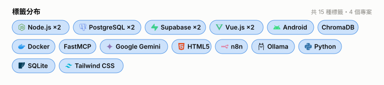
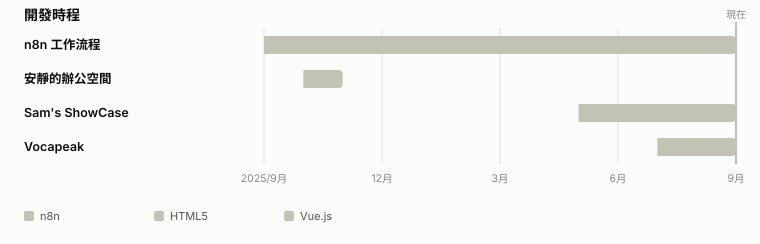
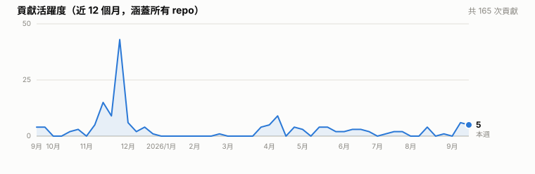

<h1 align="center">黃威儒 Sam Huang</h1>

全端工程師・碳盤查 × AI 系統｜.NET 8 / C# ・ Vue 3 ・ MSSQL

  <a href="README.md">English</a> ·
  <a href="https://www.linkedin.com/">LinkedIn</a> ·
  <a href="mailto:sam.huang.veda@gmail.com">Email</a> ·
  <!-- TODO: 換成你的 Linktree / 作品集連結 -->
  <a href="#">作品集</a>

比起「會什麼語言」，我更想讓這頁 README 說清楚**我實際做過什麼類型的專案、花多久做出來、做到多大**。技術棧列在最後面，當附錄，不當重點。

目前身分：全端工程師，同時是中興大學（資工所）在職碩士生；主線工作是企業碳排放管理系統，另外有幾個自己維護專案。

---

### 標籤分布

### 開發時程

### 貢獻活躍度

---

### 專案

#### [Vocapeak](https://github.com/samhuang95/Vocabulary_Trainer)
`Vue.js` `Android` `Supabase` `Node.js` `PostgreSQL` · 2026-07 – 進行中

單字練習 App（Web + Android）：Daily 卡片、複習、Goals 目標排程，用來準備多益，網頁連結：https://vocapeak.com
- 亮點: Goals 頁面可依目標範圍與期限自動換算每日練習量
- 技術: Vue.js · Android · Supabase · Node.js · PostgreSQL

#### [Sam's ShowCase](https://github.com/samhuang95/MyShowCase)
`Vue.js` `Tailwind CSS` `Supabase` `Node.js` `PostgreSQL` · 2026-05 – 進行中

集合所有作品內容的個人作品集網站，包含專案、文章、履歷、聯絡資訊等, 網頁連結：https://sam-showcase.com
- 亮點: 集合所有作品內容的個人作品集網站，包含專案、文章、履歷、聯絡資訊等
- 技術: Vue.js · Tailwind CSS · Supabase · Node.js · PostgreSQL

#### [安靜的辦公空間](https://github.com/samhuang95/AI-administrative)
`HTML5` `Python` `ChromaDB` `SQLite` `Google Gemini` `FastMCP` `Ollama` · 2025-10 – 2025-11

讓 LLM 利用 MCP 的方式進行 Tool Use，以此查詢資料庫、生成文件、回覆使用者問題，以此減少低產值的行政工作負擔
- 亮點: 地端 LLM 部屬於 Ollama，並使用 FastMCP 進行資料庫查詢與文件生成
- 技術: HTML5 · Python · ChromaDB · SQLite · Google Gemini · FastMCP · Ollama

#### [n8n 工作流程](https://github.com/samhuang95/n8n_workflow_storage)
`n8n` `Docker` · 2025-09 – 進行中

使用 n8n 和 Docker 建立的工作流程自動化系統
- 亮點: 通過 n8n 的視覺界面自動化重複性任務並整合各種服務
- 技術: n8n · Docker

---

技術棧（附錄）

 

**後端：** C# ・ .NET 8 ・ Entity Framework Core ・ Dapper ・ AutoMapper
**前端：** Vue 3
**資料庫：** MSSQL
**其他：** NPOI ・ Docker ・ Three.js ・ LLM 應用（RAG / 工具檢索）

最後更新：2026-09-24 23:48 UTC（GitHub Actions 自動產生，資料來源見 <code>projects.json</code>）

